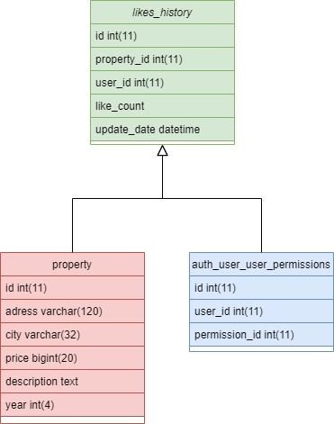

# Backend para la busqueda de apartamentos HABI

Este proyecto es un ejemplo de backend, el cual genera un microservicio, el cual con patrones como lo es repository crea la conexión a la base de datos y el patron factoria se encarga de crear errores personalizados para la respuesta del codigo.

Las tecnologías utilizadas para este backend fueron:

- Python
- server libreria para levantar una conexión https
- Conector de mysql
- re libreria para el uso de regex
- abc libreria para crear clases abstractas

## Preguntas y Respuestas

1. **Pregunta 1:** ¿Qué libreria usar para exponer el servicio?
    **Respuesta:** Para exponer el servicio según los requerimientos de usar python puro, decidí usar la librería server ya que esta librería crea una instancia para ser consumida por http de esa manera la expongo más no utilizo otra funcionalidad.

2. **Pregunta 2:** ¿Qué Patrones utilizar?
    **Respuesta:** El patron Repository lo utilice ya que con dicho patrón se puede establecer diferentes conexiones a lugares donde se guarde o consulte información siguiendo principios de arquitecturas limpias donde se habla de separar la base de datos del dominio de la aplicación.

    El patron Factory se me ocurrio para manejar los errores de una manera personalizada estableciendo una manera practica de usar dicho patron, complejiza el codigo ese es un tema negativo pero da la facilidad de usar errores personalizables.

3. **Pregunta 3:** ¿Cómo manejar erroes de data?
    **Respuesta:** Para el caso de la data decidí crear una query que me permita reducir datos incompletos a traves del where de esa manera le quito la carga al backend de tratar la data.

4. **Pregunta 4:** ¿Cómo manejar los queryparams?
    **Respuesta:** Para el caso del filtrado de información utilice la librería re la cual se encarga de buscar parametros conocidos y con ayuda de algunas funcionalidades de los string en python modifique los queryparams convirtiendolos en segmentos de sql que me complementan el filtrado de información.

5. **Pregunta 5:** ¿Cómo modificar los queryparams?
    **Respuesta:** Para el caso del manejo de los query params con funciones en el archivo helper me encargue de tratar la data  al mismo tiempo, el patron repository instancia la conexión a msql para traer la información, ser tratada y devolverla al handler.


# Microservicio de Likes

Para el caso del microservicio de likes lo que generé es la una tabla donde podemos llevar un recuento de los likes que una persona le da a un apartamento, teniendo en cuenta que le puede dar más de un like al mismo apartamento realice un columna que se encarga de guardar la cantidad de likes para de esta manera buscar apartamentos similares para mostrarle, además de relación con la tabla property para traer los datos del apto y con la tabla auth_user_user_permissions para saber que permisos tiene ya que si no se encuentra en esta tabla es porque el usuario no se ha registrado y no podría darle me gusta a los apartamentos de preferencia.

## adjunto imagen del diagrama



## Codigo MYSQL

```bash

    CREATE TABLE likes_history (
    id INT(11) AUTO_INCREMENT,
    user_id INT(11),
    apartment_id INT(11),
    like_count INT(4),
    PRIMARY KEY (id),
    FOREIGN KEY (user_id) REFERENCES auth_user_user_permissions(id),
    FOREIGN KEY (apartment_id) REFERENCES property(id)
    );

```

# Segundo punto

Para este punto cree una función recursiva con la cual se valida cada item si ese item es cero lo que hace es reemplazarlo por un 'x' el cual en la siguiente iteración valida si es cero para dejar la 7 o reemplazarla por el item y así sucesivamente, en este caso lo que hice fue buscar la manera de disminuir la complejidad ciclomatica, al usar una función recursiva y el reduce, el cual es una función que va iterar dependiendo de la cantidad de elementos que se tenga en el segundo parametro.


